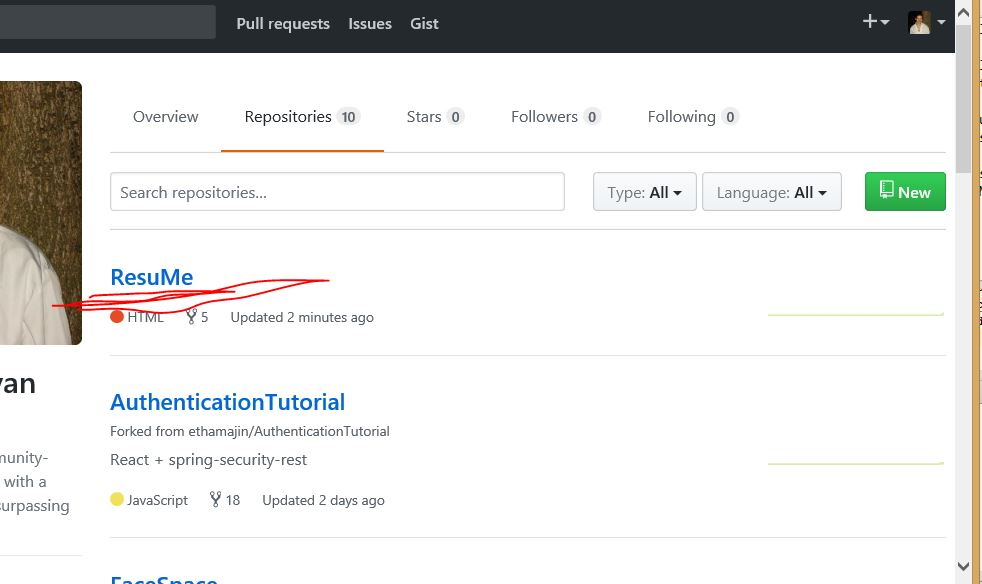

# ResuMe : How to Download and Build the Prototype!

(This guide assumes you already have the JDK installed.  If you do not, please go to <a href = "http://www.oracle.com/technetwork/java/javase/downloads/jdk8-downloads-2133151.html"> Oracle </a> and download it.

  Go to Github.  If you do not have a github account, you can sign up for a free one <a href = https://github.com/join?source=header-home> here </a>.

  Once you're signed into github, go to <a href = https://github.com/Peredwel/ResuMe> Group20's code project repository </a> .  

  Fork the repository from github by clicking on the 'Fork' button in the top right-hand corner of the screen: 

This should make the ResuMe repository appear in your Github account under your repositories:

Alternatively, you can 'Clone or Download' Group20's code project repository to your favourite web development IDE.  We used IntelliJ, and will give instructions specific to running our repository from this environment.

 You will also need to download React to use our stunning front-end user interface.  
Download <a href = https://nodejs.org/en/> node.js </a> .  Then, from commandline in unix or commandprompt in Windows, run these commands:

npm init
npm install react react-dom --save
npm install babel-core babel-preset-es2015 babel-preset-react babel-loader webpack

Downloading node.js enables you to use npm to download and install React, and enables us to integrate our React code with Gradle-based deployment with Grails in IntelliJ.  Babel is a transpiler.  <a href = https://grailsblog.objectcomputing.com/posts/2016/05/28/using-react-with-grails.html> Go to this tutorial </a> for more information.

  Now, go to your favourite IDE (we recommend <a href = https://www.jetbrains.com/idea/> IntelliJ </a> and click run.  ResuMe will appear in localhost/8080.

Now you have your very own working version of ResuMe!  
